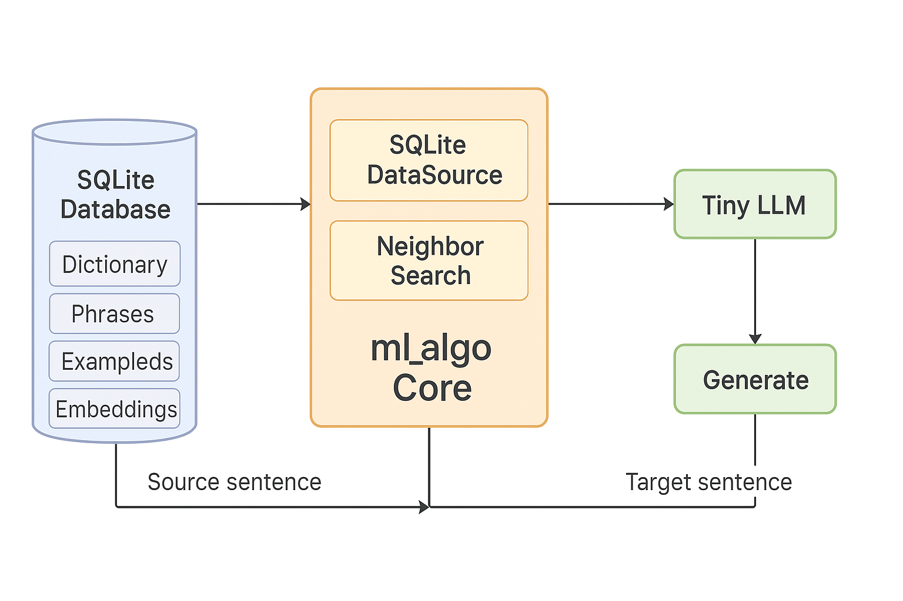

# Malinali - Local Translation App

An offline-first Flutter app for local translation using retrieval-based translation combining Full Text Search (FTS) and Semantic Search.

## Approach: Frugal, Open Source, Pragmatic

Malinali takes a **retrieval-based translation** approach rather than generative neural translation. This makes it fundamentally different from offline solutions like OpenNMT, CTranslate2, or INMT-lite.

The main reason is that low-resource languages like fula lack the resources needed for advanced machine translation techniques.

While advanced translation models (e.g. nllb) give good, they are too heavy to run locally. 

So we use a innovative low-tech solution.

1. Full Text Search based on SQLite
2. Semantic Search using embeddings/vector, based on
    - a tiny embedder [all-MiniLM-L6-v2](https://huggingface.co/sentence-transformers/all-MiniLM-L6-v2) 
    - a forked version of [ml_algo](https://pub.dev/packages/ml_algo) that stores embeddings in SQLite

Combining the two and displaying the source text, provides user with as much translation information as possible.

This approach is **imperfect but pragmatic**; 

- ✅ **Works offline**: All data stored locally, no API calls
- ✅ **Mobile-friendly**: Flutter app, runs smoothly on low-end devices
- ✅ **Fast**: Sub-20ms queries using SQLite FTS + approximate nearest neighbor search
- ✅ **Open source**: Full transparency, easy to extend and customize
- ⚠️ **Limited to training data**: Can only translate phrases seen in the corpus
- ⚠️ **No context awareness**: Each phrase translated independently
- ⚠️ **Requires quality corpus**: Translation quality depends on dataset quality

**When to use Malinali:**
- Domain-specific translations (e.g., medical, legal, technical)
- Low-resource languages with limited training data
- Imperfect translation tolerated
- Offline-first requirements
- Privacy-sensitive applications
- Resource-constrained environments

## Features

- **Hybrid Search**: Combines keyword-based (FTS) and semantic (vector similarity) search
- **Offline**: All translations stored locally in SQLite

## Dataset

License-free french/english -> fula dataset from [awesome_fula_nl_resources](https://github.com/flutter-painter/awesome_fula_nl_resources)

## Current Implementation

- Fula Translation pairs are created on first launch, embedding french (source) elements takes __up to 30 minutes__

## Future Improvements
### Better pickers

- Allow users to select .db to avoid first init delay

- Allow users to pick source/target translation texts to insert additional data or reset the app with their own custom data

- Allow users to add additional language support

### French-Specific Embedding Models

For even better French embedding quality, consider exploring French-specific models that work with `fonnx`:

- **French-optimized models**: Models like `sentence-camembert-base` or `dangvantuan/french-document-embedding` are specifically trained for French and may provide superior semantic similarity for French text
- **ONNX compatibility**: These models would need to be exported to ONNX format and may require adjustments to `EmbeddingService` (input/output tensor names, embedding dimensions)
- **Integration**: The `fonnx` package currently supports MiniLM architecture models; French-specific models may require additional adaptation or using lower-level ONNX APIs

Current model: `all-MiniLM-L6-v2` (monolingual, better for French-only comparisons than the previous multilingual model)

## BUILDME
flutter build macos
hdiutil create -volname "Malinali" -srcfolder "build/macos/Build/Products/Release/malinali.app" -ov -format UDZO "malinali.dmg"