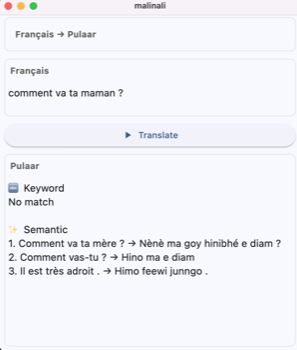

# Malinali - Local Translation App

An offline-first Flutter app for local translation using retrieval-based translation combining Full Text Search (FTS) and Semantic Search.

## Approach: Frugal, Open Source, Pragmatic

Malinali takes a **retrieval-based translation** approach rather than generative neural translation. This makes it fundamentally different from offline solutions like OpenNMT, CTranslate2, or INMT-lite.

Since low-resource languages like fula lack the resources needed for these machine translation tools they yield  poor results.

While advanced translation models (e.g. [nllb](https://huggingface.co/flutter-painter/nllb-fra-fuf-v2)) give good results, they are too heavy to run locally and incompatible with mobile OS.

So we came up with this innovative low-tech solution:

1. Full Text Search based on SQLite
2. Semantic Search using embeddings/vector, based on
    - a tiny embedder [all-MiniLM-L6-v2](https://huggingface.co/sentence-transformers/all-MiniLM-L6-v2) that runs using [fonnx](https://github.com/Telosnex/fonnx)
    - a [forked version](https://github.com/malinali-app/ml_algo) of [ml_algo](https://pub.dev/packages/ml_algo) that stores embeddings in SQLite

Combining the two and displaying the source text, provides user with as much translation information as possible.

This approach is **imperfect but pragmatic**; 

- **Works offline**: All data stored locally, no API calls
- **Mobile-friendly**: Flutter app, runs smoothly on low-end devices

**When to use Malinali:**
- Low-resource languages with limited training data
- __Imperfect translation tolerated__
- Offline-first requirements
- Privacy-sensitive applications
- Resource-constrained environments
- Domain-specific translations available for custom use (e.g., medical, legal, technical)

## Dataset

License-free french/english -> fula dataset from [awesome_fula_nl_resources](https://github.com/flutter-painter/awesome_fula_nl_resources)

## Current Implementation

- Fula Translation pairs are created on first launch, embedding french (source) elements takes __up to 30 minutes__

## Future Improvements
### Better pickers
- Allow users to select .db to avoid first init delay

- Allow users to pick source/target translation texts to insert additional data or reset the app with their own custom data

- Allow users to add additional language support

### French-Specific Embedding Models

For better French embedding quality, consider exploring French-specific models that work with `fonnx`:

- **French-optimized models**: Models like `sentence-camembert-base` or `dangvantuan/french-document-embedding`

Current model: `all-MiniLM-L6-v2` (monolingual, better for French-only comparisons than the previous multilingual model)

## BUILDME
flutter build macos
hdiutil create -volname "Malinali" -srcfolder "build/macos/Build/Products/Release/malinali.app" -ov -format UDZO "malinali.dmg"